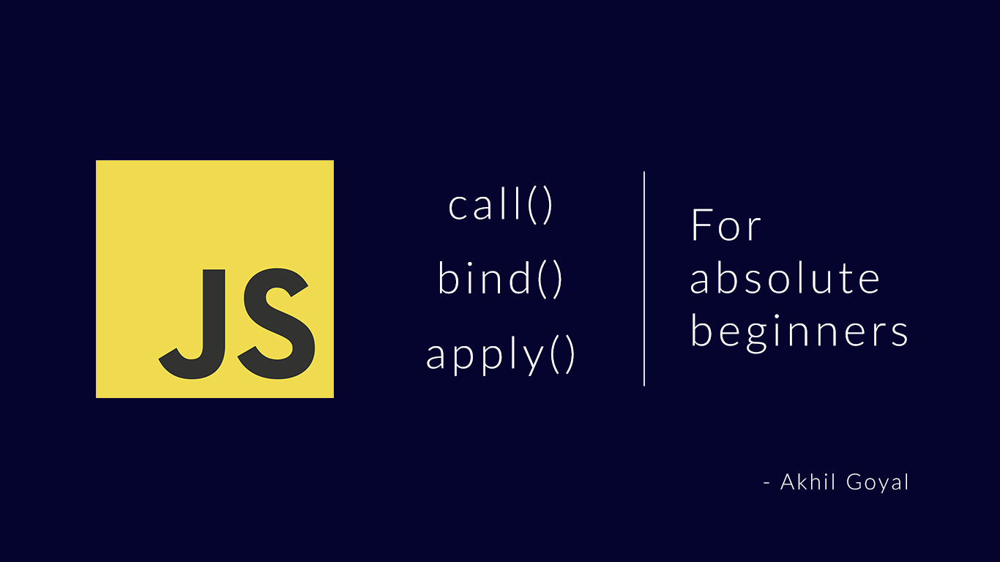
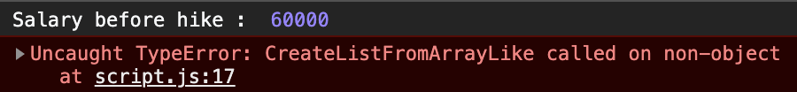

Hello everyone! In this article, we shall try to understand the functionalities of JavaScript methods call(), bind() and apply(). In order to make it simpler for everyone, we shall be trying to understand them with the help of a simple example. Also, I shall make sure to not using much tech heavy jargons, so that even the new learners may understand the working of these methods easily without having to wrap their head around other stuff. Additionally, I shall not be putting the code in a text editor or github link so as to encourage you guys to code along as you read. It would really help you a lot, trust me on this. So, without any further adieu, let’s get started –

First of all, let’s take a look at the basic example that we are going to follow. Here, we have created an object for an employee record, in which, we’ll be storing their basic information. Additionally, we’ll be setting up a method that can increment the salary of the employee by 10000.

Note : “this” keyword is referring to the object in which it is situated. If it was used outside of the object, it would have referred to the window object.

```
let employeeOne {
    fullName: 'John Doe',
    age: 24,
    salary: 40000,
    salaryHike() {
    this.salary += 10000
    }
}
```

Now that we have our object put into place, let’s use it & check if everything is working as per the expectations.

```
let employeeOne {
    fullName: 'John Doe',
    age: 24,
    salary: 40000,
    salaryHike() {
    this.salary += 10000
    }
}

console.log('Before salary hike : ', employeeOne. salary);
employeeOne. salaryHike();
console.log('After salary hike : ', employeeOne. salary);
```

Here, we’ll be checking for the results. We have invoked the .salaryHike() method which is situated inside the object employeeOne. To test the results we’ve used console.log() method before & after the .salaryHike() method is invoked. This would yield the following result –


Looks good, right? That’s what we expected given the existing salary & the hike. Now, that we’ve understood the basic functionality of this example, let’s get to the good stuff we all are here for.

Consider that we have another employee with an object to store records of their own, like so –

```
let employeeOne = {
    fullName: 'John Doe',
    age: 24,
    salary: 40000,
    salaryHike() {
    this.salary += 10000
    }
 }

let employeeTwo = {
fullName: 'Sarah Green',
age: 26,
 salary: 60000 
}
```

Now, the real question is, how do we implement the salaryHike() method for employeeTwo object. One could easily say, “Why don’t we simply copy & paste the salaryHike() method for object employeeTwo as well?” Yes, we could. But, one of the popular principles of programming is “Do not repeat yourself”. Therefore, we do not want to be writing the same method for every employee record we create, do we? Therefore, what we could do is to borrow the salaryHike() method from object employeeOne & use it for employeeTwo. Still confused? Don’t worry, let’s see it in action & we’ll gain more clarity as we progress ahead.

## .call()

This method is used to call a function with given value & arguments. Know that when we invoke a function in JavaScript like functionName(), under the hood, it actually works like functionName.call(). Here, we’ll be using .call() method to borrow the salaryHike() method from employeeOne & use it for employeeTwo. Sounds exciting? Let’s see how we can do it –

```
let employeeOne = {
    fullName: 'John Doe',
    age: 24,
    salary: 40000,
    salaryHike() {
        this.salary += 10000
    }
}

let employee Two = {
    fullName: 'Sarah Green',
    age: 26,
    salary: 60000
}

console.log(employeeTwo. salary);
employeeOne. salaryHike.call(employeeTwo);
console.log(employeeTwo. salary);
```

Here, we are invoking the salaryHike() method of employeeOne & using .call() method to borrow this method & use it for employeeTwo object. Using .call() method, we are providing new value to it as well. It will now point to the salary property of employeeTwo. To check the desired outcome, we are using console.log() method to check for the output before & after the method is invoked.


See? employeeTwo had the initial salary value of 60000, which after the hike has now jumped to 70000. Good for Sarah! We should all be happy for her. Now, take a look at the salaryHike() method inside object employeeOne, you’ll see that we have set a static value of 10000 whenever this function is called. Let’s change that & make it a dynamic one, so that we can give different amount of hikes to different employees on the basis of their performance.

```
let employeeOne = {
    fullName: 'John Doe',
    age: 24,
    salary: 40000,
    salaryHike(hike) {
        this.salary += hike
    }
}

let employeeTwo = {
    fullName: 'Sarah Green',
    age: 26,
    salary: 60000
}

console.log('Salary before hike : ', employeeTwo. salary);
employeeOne. salaryHike.call(employee Two, 20000);
console.log('Salary after hike :', employeeTwo. salary);
```

Here, you’ll see that, in the .call() method, we can set arguments as well, such that, we are setting the value of 20000 as an argument. Apart from that, the salaryHike() will receive hike as a parameter, which can be further used to increment the salary.

## .apply()

Now, let’s try to implement the same example by replacing .call() method with .apply().

```
let employeeOne = {
    fullName: 'John Doe',
    age: 24,
    salary: 40000,
    salaryHike(hike) {
        this.salary += hike
}

let employeeTwo = {
    fullName: 'Sarah Green',
    age: 26,
    salary: 60000
}

console.log('Salary before hike : ', employeeTwo. salary);
employeeOne. salaryHike.apply(employeeTwo, 20000);
console.log('Salary after hike :', employeeTwo. salary);
```

We have not changed anything, except for replacing .call() with .apply(). Now, let’s check the output –



Here, as you can see, we receive an error. It has occurred because we can not set the arguments in .apply() method like we did in the .call() method. In .apply() method, the arguments need to be passed within an array, like so –

```
let employeeOne {
    fullName: 'John Doe',
    age: 24,
    salary: 40000,
    salaryHike(hike) {
        this.salary += hike
    }
}

let employeeTwo {
    fullName: 'Sarah Green',
    age: 26,
    salary: 60000
}

console.log("Salary before hike : ', employeeTwo. salary);
employeeOne, salaryHike.apply(employeeTwo, [20000]);
console.log('Salary after hike :', employeeTwo. salary);
```

Now, we have passed the argument, that is, 20000, in an array, which yields the expected result –


## .bind()

Now, let’s implement the same example by replacing .apply() method with .bind(). Also, we shall be passing the argument in the same way as we did in the case of .call() method, like so –

```
let employeeOne = {
    fullName: 'John Doe',
    age: 24,
    salary: 40000,
    salaryHike (hike) {
        this.salary += hike
    }
}

let employeeTwo = {
    fullName: 'Sarah Green',
    age: 26,
    salary: 60000
}

console.log("Salary before hike : ', employeeTwo. salary);
employeeOne.salaryHike.bind(employeeTwo, 20000);
console.log('Salary after hike :', employeeTwo. salary);
```

As you can see, everything is still the same, except for we have now replaced .apply() with .bind() & passed the argument value of 20000 without putting it into an array. Let’s take a look at its output –


Something is strange. Isn’t it? Although we are not getting any error, but at the same time, our output is not as per our expectation. We should have received 80000 salary after the hike, but it’s unchanged. It’s due to the fact that when we use .bind() method, it returns a function. Let’s check it out –

```
let employeeOne = {
    fullName: 'John Doe',
    age: 24,
    salary: 40000,
    salaryHike(hike) {
        this.salary += hike
    }
}

let employeeTwo = {
    fullName: 'Sarah Green',
    age: 26,
    salary: 60000
}

console.log("Salary before hike : ', employeeTwo. salary);

let hikeEmployeeTwo = employeeOne. salaryHike.bind(employeeTwo, 20000);

hikeEmployeeTwo();

console.log('Salary after hike :', employeeTwo. salary);
```

Here, we are assigning the returned function by .bind() method to variable hikeEmployeeTwo. This variable now acts as a function which is further invoked in the next line. Let’s now see if it is working in the way we expect it to be –


Voila! It is working as it is supposed to be. The benefit of this method is that we can now invoke this method anywhere & any number of times, which would yield the expected results.

So, this is the easiest way we can understand the working of call(), apply() & bind() methods. I hope it has helped you to get an idea about how to approach these methods & how they can be beneficial at various stages of programming. If you want me to bring out another simplified article for you on a specific topic, let me know in the comments section. If you feel you’ve gained something from this article & such simplified articles should keep coming, kindly consider supporting me by donating at paypal.me/topcoded. Stay tuned to TopCoded. See you guys in the next one. Keep coding! 🙂