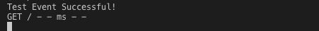
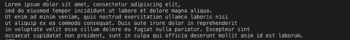
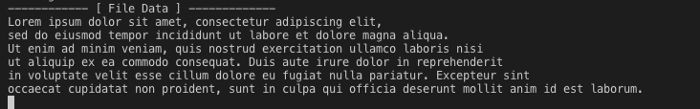
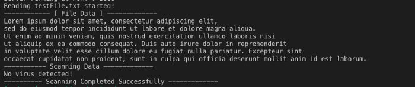
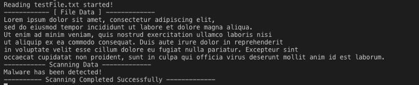

When it comes to Node.js, one of its pros include that its best suited for Event driven programming. In this article, we’ll discover what event driven programming is & a few simple examples that showcase its usage in easiest way possible. By the way, what is this event driven approach? Let’s find out –

There are many objects in Node.js that emit events such as fs.ReadStream() emits an event whenever a file is opened. Any object that emits event is an instance of EventEmitter class. Let’s see how can we import events in our Node.js application –

```
var events = require(“events”);
```

And the way we can initialize an EventEmitter class is –

```
var eventsEmitter = new events.EventEmitter();
```

Pretty simple? Right? Well, in the examples to follow, we’ll be making use of Node.js File System. If you’re not aware of how to use File System, you can take a cue from here. Let’s begin with a very minimal example –

## Example

```
var express = require('express');
var router = express.Router();
var events = require('events');
var eventsEmitter = new events.EventEmitter();

// Defining an event.
eventsEmitter.on('test', () => {
  
    console.log('Test Event Successful!');
  
});

router.get('/', (req, res) => {
    //Subscribing to an event
    eventsEmitter.emit('test');
});

module.exports = router;
```

In this example, we’re firing up an event whenever ‘/’ route is hit. We can use .emit() method to initialize an event & the first argument it takes is the name of event. i.e test in this case. Now, we use .on() method to prescribe what happens when that particular event i.e test in this case, is fired up. This would yield the following output –



Easy? Alright, so let’s move on to the next level and make use of File System to read a file using event emitter.

```
var express = require('express');
var router = express.Router();
var events = require('events');
var fs = require('fs');
var eventsEmitter = new events.EventEmitter();

eventsEmitter.on('read', (fileName) => {
  
    fs.readFile(fileName, 'utf8', (error, data) => {
      
        if (error) {
          
            console.log(error);
          
        } console.log(data);
      
    });
  
});

router.get('/', (req, res) => {
    eventsEmitter.emit('read', 'testFile.txt');
});

module.exports = router;
```

In this example, we’re using .emit() method to fire up an event i.e read in this case. It takes the name of event as first argument & we can pass an object as second in case we want to use something in the function associated to that event. In this case we’re using testFile.txt that we want to read when the event is fired up. Using .on() method, we can set the name of event i.e read in this case & a function with parameter fileName. This will yield us the following output –



See? We just read a file using Event Emitter. Okay, so let’s move on to use multiple events. Consider the following example –

```
var express = require('express');
var router = express.Router();
var events = require('events');
var fs = require('fs');
var eventsEmitter = new events.EventEmitter();

eventsEmitter.on('read', readFileContent);
eventsEmitter.on('show', showData);

function readFileContent(fileName) {
  
    console.log(`Reading ${fileName} started!`);
  
    fs.readFile(fileName, 'utf8', (error, data) => {
      
        if (error) {
          
            console.log(error);
          
        } eventsEmitter.emit('show', data);
      
    });
  
}

function showData(data) {
  
    console.log('-------- [ File Data ] ---------');
  
    console.log(data);
  
}
router.get('/', (req, res) => {
    eventsEmitter.emit('read', 'testFile.txt');
});

module.exports = router;
```

In this example, we’ve declared two events i.e read & show, executing readFileContent & showData functions respectively. Like in the previous example, we’re firing up read event from the get(‘/’) request along with the file name testFile.txt. We obtain this file name in readFileContent function using parameter i.e fileName in this case. When the .readFile() method of File System module returns the file data, we send it as second parameter along with calling of show event. This show event in turn will call the function showData. We obtain the file data in showData’s parameters & display it. Lets check its output –




So, in this way, we can use multiple events to handle events in parts in order to execute the functions more gracefully & in a controlled way. Okay so, let’s extend this tutorial to add one another example that can show us how to handle events on conditional basis. Let’s check that out –

```
var express = require('express');
var router = express.Router();
var events = require('events');
var fs = require('fs');
var eventsEmitter = new events.EventEmitter();

eventsEmitter.on('read', readFileContent);
eventsEmitter.on('show', showData);
eventsEmitter.on('check', checkData);
eventsEmitter.on('success', successFuction);
eventsEmitter.on('failed', failFunction);
eventsEmitter.on('finish', finishedFunction);

function readFileContent(fileName) {
  
    console.log(`Reading ${fileName} started!`);
  
    fs.readFile(fileName, 'utf8', (error, data) => {
      
        if (error) {
          
            console.log(error);
          
        } eventsEmitter.emit('show', data);
      
    });
  
}

function showData(data) {
  
    console.log('-------- [ File Data ] ---------');
  
    console.log(data);
  
    eventsEmitter.emit('check', data);
  
}

function checkData(data) {
  
    console.log('-------- Scanning Data ---------');
  
    if (data.includes("virus")) {
      
        eventsEmitter.emit('success');
      
    } else {
      
        eventsEmitter.emit('failed');
      
    }
  
}

function successFuction() {
  
    console.log('Malware has been detected!');
  
    eventsEmitter.emit('finish');
  
}

function failFunction() {
  
    console.log('No virus detected!');
  
    eventsEmitter.emit('finish');
  
}

function finishedFunction() {
  
    console.log('-------- Scanning Completed Successfully --------');
  
}

router.get('/', (req, res) => {
    eventsEmitter.emit('read', 'testFile.txt');
});

module.exports = router;
```

Seems too much to get it all at once? Relax, we’ll split its explanation on point basis in order to get hold of what all is going on in there. So, let’s start –

> 1. Firstly, we’re firing up read event whenever get(‘/’) route is being hit. We pass along the file name to be used in this example i.e testFile.txt (Refer to line number 53).
> 2. Now, we have used .on() method to assign functions for each event fired up. (Refer from line number 7 to 12).
> 3. Like in previous example, we get the data in showData function. From here, we emit another event called check and pass along the data. (See line number 26).
> 4. In checkData function, we receive the data using parameter value. In this function, we’ll be checking if a word exists in the file we’ve just completed reading. Consider it as a Malware detection program 😛
> 5. We’ll be using javascript’s .includes() method to check if a substring is present in a string or not. In this case we’ll be checking if our file data contains the work “virus” in it. (Refer to line number 31).
> 6. If the substring is present in the string, then event success is fired up. Otherwise, events failed is referred to. (Refer to lines 32 & 34).
> 7. Both the functions successFunction & failedFunction hits the finish event after their successful completion. (Refer to lines 40 & 45).
> 8. When finish event is fired up, it executes finishedFunction and is therefore the end of these events as there are no further events that have been subscribed to.

The above stated example will produce the output –



And if we include the word “virus” in our testFile.txt, it would result into this –



## Conclusion

That was fun, right? There are plenty of other things that go around with Event Emitters but I wanted it to be as beginner friendly as it can, so may be, we’ll cover other areas of it in some upcoming article. So, that’s the way you can divide your Node.js processes into individual events & connect them in a fashion you want. I hope, it helped you to understand what’s going around with Event Emitters, or at least, it must have given you a start. If you feel you’ve gained something from this article & such simplified articles should keep coming, kindly consider supporting me by donating at paypal.me/topcoded. For any suggestions, please drop a comment so that I may keep improving the content for you. For more of such simplified articles, stay tuned to TopCoded. Thanks for reading. See you in the next one 🙂