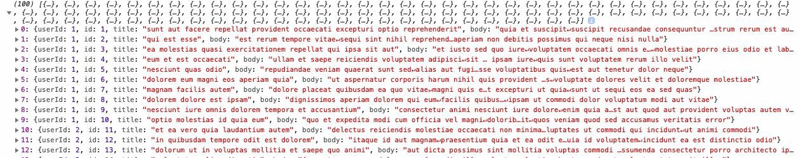

If you’ve been working with server side platforms like Node.js, you must have felt the pain of dealing with Asynchronous code, especially, when your application has too much of I/O in it. To deal with asynchronous code, callbacks & promises make their way into the picture. As dealing with callback functions adds to further woes of a developer, promises turn out to be more promising for making the code behave in a synchronous manner. In this article, we shall try to understand promises in easiest way possible. First of all, what promise actually is? The official documentation of promise states that :-

> The Promise object represents the eventual completion (or failure) of an asynchronous operation, and its resulting value.

As the above statement states, after an asynchronous operation has been processed completely, we shall be left with two events i.e success/failure or more popularly known as resolve/reject. We can set our required response in the resolve event & fire up reject event in case of any error/exception. Let’s dive into some code to get a better understanding of the things.

```
'use strict'

var promise = new Promise((resolve,reject) => {
  
    resolve('Promises are meant to be broken.');
  
});

console.log(promise);
```

In the above illustrated example, we’ve used a promise constructor as per ES6 syntax & this will return two events i.e resolve/reject. Here, we’re resolving a simple string & logging the promise thereafter. Here’s what you’ll get as an output –


As you can see that, our promise has been resolved, but in order to fetch its value, we need to use .then()/.catch() methods.

```
'use strict'

var promise = new Promise((resolve,reject) => {
  
    resolve('Promises are meant to be broken.');
  
});

promise.then((result) => {
  
    console.log(result);
  
}).catch((error) => {
  
    console.log(error);
  
})
```

Now, using .then() and .catch(), we can return value of the called handler i.e. resolve/reject. Now, we can obtain our desired output as following –


Simple? Isn’t it? Now, let’s check out how can we work with multiple promises. Consider two promises promise1 & promise2, both resolving some asynchronous code & retuning the data. We need to resolve both of them & obtain the desired output. Let’s checkout how –

```
'use strict'

// First Promise
var promise1 = new Promise((resolve, reject) => {
    var a = 15;
  
    var b = 5;
  
    var c = a + b;
  
    //Resolving the sum obtained.
    resolve(c);
  
});

// Second Promise
var promise2 = new Promise((resolve, reject) => {
  
    var x = 5;
  
    var sum = null;
  
    // Obtaining the value returned by first promise.
    promise1.then((result) => {
      
        sum = result + x;
      
        resolve(sum);
      
    });
});

// Obtaining the sum returned by second promise.
promise2.then((finalResult) => {
  
    console.log(finalResult);
  
}).catch((error) => {
  
    console.log(error);
  
})
```

In the above shown example, we have two promises i.e promise1 & promise2. In promise1, we’re making simple addition calculation & passing the result in resolve event. Now, in promise2, we’re resolving the promise1 & obtaining its value i.e 20 & performing another calculation before passing the final result into promise2’s resolve event. At last, we can use .then() method to fetch the final output i.e –


In this way, we can get a fair idea about how can we deal with multiple promises. But in real world applications, we just simply don’t want to play with numbers, right? We need to use REST Apis in order to keep our applications going, so let’s see how we can use a GET API and resolve its response.

```
'use strict'

fetch('https://jsonplaceholder.typicode.com/posts')
    .then(res => {
  
        res.json()
  
            .then((data) => {
          
                console.log(data);
          
            })
  
    }).catch((error) => {
  
        console.log(error);
  
    })
```

In the above stated example, we’re using a public GET api and using JavaScript’s built-in fetch method for it. The fetch method itself returns a promise on completion of a request. Therefore, we’re obtaining its response using the res variable. We now want to obtain the data in JSON format using res.json() method, which in turn returns another promise. The promise returned by res.json() can be resolved using .then() method and obtaining the final result in data variable. Output for the above stated code will be as following –



As you can see that, it will return an array of data that you can further use in your application. What about the .catch() block though? We’ve not tested that till yet. Let’s make a mistake in order to test that.

```
'use strict'

fetch('https://jsonplaceholdertypicode.com/posts')
    .then(res => {
  
        res.json()
  
            .then((data) => {
          
                console.log(data);
          
            })
  
    }).catch((error) => {
  
        console.log('Checking for error - ', error);
  
    })
```

Notice what we did here? We just tweaked our API url such that the period (.) has been removed before typicode, that makes it an invalid url of course. So, let’s test that & see what we get in return.


## Conclusion

See? we made our way to the .catch() block by using an invalid API url. In this way, we can get to know about errors/exceptions using reject events & catching the returned data in .catch() block. Therefore, in this way, we can reduce the pain of asynchronous code in Node.js and make it work the way we want using promises. I hope it has acted as an ice breaker & given you a fair amount of idea about how you can use promises to make your code work in a synchronous manner. If you feel you’ve gained something from this article & such simplified articles should keep coming, kindly consider supporting me by donating at paypal.me/topcoded. To read more of such simplified articles, stay tuned to TopCoded. See you guys in the next one. Keep coding! Keep Promising! 😉